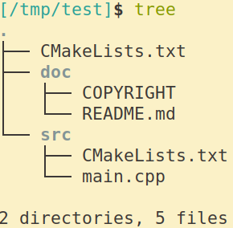

# 更好一点的Hello World

* 为工程添加一个子目录`src`,放置源代码
* 使用外部构建(out-of-source)
* 安装可执行文件,头文件,文档(没有)

---


## 工程下的CMake文件

```cmake
# set minimum version required
cmake_minimum_required(VERSION 3.10.2)

# set project name
project(hello)

# add_subdir
add_subdirectory("src" "bin")

# set cmake install prefix
SET(CMAKE_INSTALL_PREFIX "/tmp/usr")

# install document
install(DIRECTORY "doc/"
        DESTINATION "doc/cmake")
```

## src下的CMake文件

```cmake
set(src_list "main.cpp")

add_executable(hello ${src_list})
# now hello is a unique target

# install target
install(TARGETS hello
        RUNTIME DESTINATION "bin")

# install src
install(FILES ${src_list}
        DESTINATION "src")
```

## mainc.pp

```cpp
#include <iostream>

using namespace std;

int main(int, char **)
{
    cout << "CMake is very interesting." << endl;
    return 0;
}
```

## 小结

* `mkdir build` `cd build` `cmake ..` `make` `make install`
* `add_subdirectory("src" "bin")`
* 如果要执行`make install`动作,别忘了设置`CMAKE_INSTALL_PREFIX`变量;如果没有设置,默认位`/usr/local`下面.
* 个人不喜欢`cmake -DCMAKE_INSTALL_PREFIC=/tmp/usr ..`这种设置方式,所以直接写在文件中.
* 安装`target`

```cmake
    install(TARGETS main hello hello_static
        RUNTIME DESTINATION bin
        LIBRARY DESTINATION lib
        ARCHIVE DESTINATION libstatic)
```

* 安装文件

```cmake
    install(FILES file1 file2
        DESTINATION <dir>)
```

* 安装目录

```cmake
    install(DIRECTORY dir1 dir2/
        DESTINATION <dir>)
```

* `dir1` 和 `dir2/`是有区别的,前者是把整个目录拷贝到`<dir>`下面;后者是把目录中的内容拷贝到`<dir>`中.
