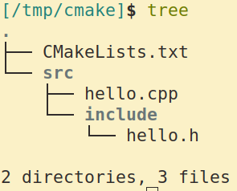

# 静态库与动态库的构建

## 构建一个随便~\(≧▽≦)/~啦啦啦



```cpp
// hello.cpp
#include "hello.h"
#include <iostream>

using namespace std;

void hello()
{
    cout << "ni hao xiao na" << endl;
}

void bye()
{
    cout << "bye bye xiao na" << endl;
}
```

```cpp
// hello.h
#ifndef HELLO_H
#define HELLO_H

void hello();
void bye();

#endif // HELLO_H
```

```cmake
# CMakeLists.txt
cmake_minimum_required(VERSION 3.10.2)

project(hello)

set(work_dir ${CMAKE_SOURCE_DIR})

include_directories("${work_dir}/src/include")

set(src_list "${CMAKE_SOURCE_DIR}/src/hello.cpp")
set(include_dir "${work_dir}/src/include")

add_library(hello SHARED ${src_list})
add_library(hello_static STATIC ${src_list})

set_target_properties(hello PROPERTIES VERSION "1.8.2" SOVERSION "1")
set_target_properties(hello_static PROPERTIES OUTPUT_NAME "hello")

get_target_property(out_name hello_static OUTPUT_NAME)
message("== " ${out_name})

# install
set(CMAKE_INSTALL_PREFIX "/tmp/usr")

install(TARGETS hello hello_static
        ARCHIVE DESTINATION lib
        LIBRARY DESTINATION lib)

install(DIRECTORY "${include_dir}/"
        DESTINATION "/tmp/usr/include")
```

编译流程: 创建一个build文件夹,然后进入;

`cmake ..`

`make`

`make install`

完成.

## Document

* ADD_LIBRARY

```cmake
add_library(<name> [STATIC | SHARED | MODULE]
        [EXCLUDE_FROM_ALL] source1 [source2 ...])
```

* SET_TARGET_PROPERTIES

```cmake
set_target_properties(target1 target2 ...
        PROPERTIES prop1 value1
                   prop2 value2...)
```

* GET_TARGET_PROPERTY

```cmake
get_target_property(<variable> target property)
```

## 小结

* add_library
* set_target_properties
* get_target_property