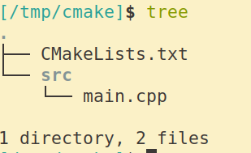

# 使用外部共享库和头文件

## Use it



```cpp
// main.cpp
#include "hello.h"
#include <iostream>

using namespace std;

int main(int, char**)
{
    cout << "----------" << endl;
    hello();
    cout << "----------" << endl;
    bye();
    cout << "----------" << endl;
    return 0;
}
```

```cmake
# CMakeLists.txt
cmake_minimum_required(VERSION 3.10.2)

project(hello)

set(work_dir ${CMAKE_SOURCE_DIR})
set(src_list "${work_dir}/src/main.cpp")

include_directories("/tmp/usr/include")

link_directories("/tmp/usr/lib")

add_executable(main ${src_list})
target_link_libraries(main hello)

# install
set(CMAKE_INSTALL_PREFIX "/tmp/usr")

install(TARGETS main
        RUNTIME DESTINATION "bin")
```

## 编译

* mkdir build
* cd build
* cmake  ..
* make
* make install

然后跳转到`/tmp/usr/bin`下面发现无法运行`main`

    ./main: error while loading shared libraries: libhello.so.1: cannot open shared object file: No such file or directory

进行如下操作(OS:Ubuntu 18.04)

* cd /etc
* sudo vi ld.so.conf
* 看一眼就明白了
* 有个性的我添加了一行`include /etc/ld.so.conf.d/*.self`
* cd ld.so.conf.d
* sudo vi Zhao_Ri_Tian.self
* 输入: `/tmp/usr/lib`
* sudo ldconfig

这样就可以找到了.

## Document

* include_directories

```cmake
include_directories(dir1 [dir2 ...])
```

* link_directories

```cmake
link_directories(dir1 dir2...)
```

* target_link_libraries

```cmake
target_link_libraries(<target> ... <item>... ...)
```

## 小结

* include_directories
* link_directories
* target_link_libraries
* ld.so.conf
* sudo ldconfig
