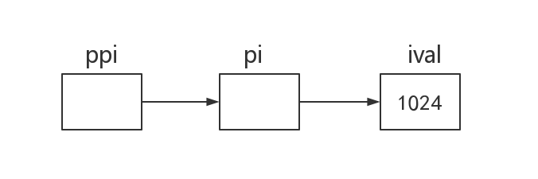

[TOC]

# 复合类型——指针和引用

> 一条简单的声明语句由一个数据类型和紧随其后的一个变量名列表组成。其实更通用的描述是，一条声明语句由一个**基本数据类型**(base type)和紧随其后的一个**声明符**(declarator)列表组成。每个声明符命名了一个变量并指定该变量为与基本数据类型有关的某种类型。

## 引用

> 严格来讲，当我们说术语“引用”时，指的其实是“左值引用”

**引用**(reference)为对象起了另外一个名字，引用类型 引用(refers to)另外一种类型。通过将声明符写成`&d`的形式来定义引用类型，其中`d`是声明的变量名。

```cpp
	int ival = 1024;
	int &refVal = ival;		// refVal指向iVal(是iVal的另一个名字)
	int &refVal2;			// 报错：引用必须被初始化
```

一般在初始化变量时，初始值会被拷贝到新建的对象中。然而定义引用时，程序把引用和它的初始值**绑定**(bind)在一起。因为无法令引用重新绑定到另一个对象上，<u>**因此引用必须初始化**</u>

> Note：引用并非对象，相反的，它只是为一个已经存在的对象所引起的另外一个名字。

定义了一个引用之后，对其进行的所有操作都是在与之绑定的对象上进行的。

```cpp
	refVal = 2;			// 把2赋给refVal指向的对象
	int ii = refVal;	// 与ii = ival执行结果一样
	int i = refVal;		// i被初始化位ival的值
```

因为引用本身不是一个对象，所以不能定义*引用的引用*。

### 引用的定义

```cpp
int i = 1024, i2 = 2048;		// int int
int &r = i, r2 = i2;			// ref int
int i3 = 1024, &ri = i3;		// int ref
int &r3 = i3, &r4 = i2;			// ref ref
```

除了`int i = 12343; const int &ref = i;`和`父类引用指向子类对象`两种情况外，其他所有引用的类型都要和与之绑定的对象严格匹配。而且，引用只能绑定在对象上，而不能与<u>字面值</u>或<u>某个表达式</u>的计算结果绑定在一起。

## 指针

指针本身就是一个**对象**，允许对指针赋值和拷贝，而且在指针的生命周期内它可以先后指向几个不同的对象；指针无须在定义时赋初值。

定义指针类型的方法将声明符写成`*d`的形式，其中`d`是变量名。如果在一条语句中定义了几个指针变量，每个变量前面都必须有符号`*`:

```cpp
	int *ip1, *ip2;		// int *	int *
	double dp, *dp2;	// double	double *
```

### 获取对象的地址

指针存放某个对象的地址，要想获取该地址，需要使用**取地址符**(&):

```cpp
	int ival = 42;
	int *p = &ival;		// p存放ival的地址
```

> 因为引用不是对象，没有实际地址，所以不能定义指向引用的指针。

### 指针的值

指针的值（即地址）应属下列4中状态之一：

1. 指向一个对象。
2. 指向紧邻对象所占空间的下一个位置。
3. 空指针，意味着指针没有指向任何对象。
4. 无效指针，也就是上述情况之外的其他值。（野指针）

> 对于第二点，`vector<int> vint(10)`的`vint.end()`就是指向最有一个元素对象的下一个位置(超尾)。

### 利用指针访问对象

如果指针指向了一个对象，则允许使用**解引用符**(*)来访问该对象：

```cpp
	int ival = 42;
	int *p = &ival;
	cout << *p;		// cout << ival;
```

对指针解引用会得出所指的对象，因此如果给解引用的结果赋值，实际上也就是给指针所指的<u>对象</u>赋值：

```cpp
	*p = 9;
	cout << *p; // out put nine
```

> Note:解引用操作仅适用于那些确实指向了某个对象的**有效**指针。

```cpp
	int i = 42;
	int &r = i;			// r是引用
	int *p;				// p是指针
	p = &i;				// 取地址
	*p = i;				// 解引用
	int &r2 = *p;		// ...
```

### 空指针

**空指针**(null pointer)不指向任何对象，在试图使用一个指针前代码可以检查它是否为空。

```cpp
int *p1 = nullptr;	// c++11
int *p2 = 0;
int *p3 = NULL; // #include <cstdlib>
```

```cpp
int zero = 0;
int *pi = zero;		// error: can not 把int变量直接赋给指针
```

### 其他指针操作

> if(pointer)	==	!=

只要指针拥有一个合法值，就能将它用在条件表达式中。如果指针的值是0，条件取`false`；任何非0指针对应的条件值都是`true`。

对于两个类型相同的合法指针，可以用相等操作符(==)或不相等操作符(!=)来比较他们。

两个指针相等有三种可能：

1.  他们都为空
2.  都指向同一个对象
3.  指向了同一个对象的下一地址

需要注意的是，一个指针指向某对象，同时另一个指针指向另外对象的下一地址，此时也有可能出现两个指针相等。

### void* 指针

**void***是一种特殊的指针类型，可用于存放任意对象的地址。

void*指针可以：

+ 和别的指针比较(不是void*也可以)
+ 作为函数的输入或输出
+ 赋给另外一个void*指针

> Note：不能直接操作void*指针所指的对象，因为我们并不知道这个对象到底是什么类型，也就无法确定能在这个对象上做那些操作。

### 理解复合类型的声明

*int* <u>i</u> = 1024, <u>*p</u> = &i, <u>&r</u> = i;

- int为基本数据类型
- `i`、`*p`、`&r`为声明符
- `i`、`p`、`r`为变量

变量的定义包括一个基本数据类型(base type)和一组声明符。

### 指向指针的指针

```cpp
int ival = 1024;
int *pi = &ival;	// pi指向一个int型的整数
int **ppi = &pi;	// ppi指向一个int型的指针
```



### 指向指针的引用

引用本身不是一个对象，因此不能定义指向引用的指针。但指针是对象，所以存在对指针的引用。

```cpp
int i = 42;
int *p;
int *&r = p;

r = &i;
*r = 0;
```

要理解`r`的类型到底是什么，最简单的办法是<u>从右向左</u>阅读`r`的定义。离变量名最近的符号(此例中是&r的符号&)对变量的类型有最直接的影响。因此`r`是一个引用。声明符其余部分用以确定`r`引用的类型是什么，此例中的符号`*`说明`r`引用的是一个指针。

> 面对一条比较复杂的指针或引用的声明语句时，从右向左阅读。

