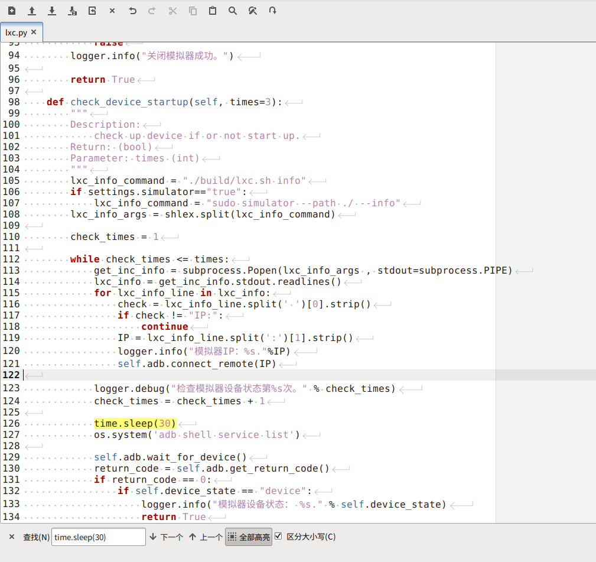

# 819B单体测试环境

[TOC]

## ~~模拟器环境~~

> 这一节的手顺也许有用

根据`819b_java_UT.docx`文件配置好模拟器环境，成功编译模拟器。

然后启动模拟器(第一次初始化时间久一些)

启动模拟器后，进入adb，`service list`列出100+个service证明模拟器已完全启动。

## 模拟器环境配置

> 最新的方法
>
> 我也不知道为什么非要用docker环境，我觉得可能是CI担当写的手顺，他们在服务器上跑UT，所以用到docker环境

### 拉取代码

```
1.1 repo init -u ssh://172.26.14.22:29418/tamago/platform/manifest -b tamago/master -m lxc.xml
1.2 repo sync -c --no-tags
1.3 repo start mybranch --all (mybranch可根据自己习惯设置)
1.4 进入docker环境。
1.5 （docker环境）cd device/pioneer/packages/jupitui/Apks 路径下 执行 "git lfs pull origin" 来更新预置的apk。
1.6 （docker环境）source build/envsetup.sh
1.7 （docker环境）lunch (lunch 选项选 "lxc_x86_64-userdebug")
1.8 （docker环境）make update-api -j4
1.9 （docker环境）make -j4
1.10（docker环境）编译成功之后 执行 "lxc session-manager-start" 来编译 session-manager,如果执行过程中最后出现 "Failed to creat sockets" 可忽略。
```


## 手动测试

`819b_java_UT.docx`文档上的手动测试手顺，亲测成功的。

主要需要四个原料:

1. 测试apk
2. 源代码apk
3. coverate.em文件
4. coverage.ec文件

### 启动模拟器

> 如果用docker环境编译模拟器，启动模拟器要推出docker环境，启动失败需要更改protobug和boost版本 [传送门](#lxc_start_fail)

`lxc start`

详细参考:`lxc --help`

adb也可以进入模拟器

### 编译源代码APP

`EMMA_INSTRUMENT=true EMMA_INSTRUMENT_STATIC=true make voiceassistant`

### 编译测试APP

`EMMA_INSTRUMENT=true EMMA_INSTRUMENT_STATIC=true make voiceassistanttest`

### 安装APP

`adb install -r -g out/target/product/tamago_1T/system/priv-app/voiceassistant/voiceassistant.apk`

`adb install -r -g out/target/product/tamago_1T/data/app/voiceassistanttest/voiceassistanttest.apk`

### 打印所有的测试包（可选）

`adb shell pm list instrumentation`

### 运行测试程序

```
adb shell am instrument -w -r -e coverage true jp.pioneer.ceam.voiceassistant.test/android.support.test.runner.AndroidJUnitRunner
```

### 拉取覆盖率报告coverage.ec文件

`adb pull /data/user/0/jp.pioneer.ceam.voiceassistant/files/coverage.ec /tmp/zuozuo`

### 拷贝coverage.em文件

`cp out/target/common/obj/APPS/voiceassistant_intermediates/coverage.em /tmp/zuozuo`

### 生成HTML测试报告

`java -jar prebuilts/sdk/tools/jack-jacoco-reporter.jar --metadata-file /tmp/zuozuo/coverage.em --coverage-file /tmp/zuozuo/coverage.ec --report-dir /tmp/zuozuo/ --source-dir device/pioneer/frameworks/VoiceServer/VoiceAssistant/app/src/main/java`

### 本地测试脚本

路径:

`./819B/device/pioneer/frameworks/VoiceServer/VoiceAssistant/app/src/androidTest/loc
altest.sh`

把这个文件放到根目录下运行

`bash localtest.sh`

## Suntest

> 截止到2019年11月29日 suntest 版本更新到3.8.0, 黄老师的脚本还是有问题
>
> 需要修改脚本
>
> * 模拟器完全启动里面的service 大约一百四十多个(141个)
> * adb shell 中`service list`可以查看
> * 本地普通PC机跑suntes需要该Suntest 配置文件和脚本才行。


### 更改的配置文件`819b.conf`

> 819b.conf文件路径：/home/zuoshiyu/workspace/myproject/venv/lib/python2.7/site-packages/Suntest-3.8.5-py2.7.egg/suntest/config/819b.co
> nf
>
> 注意b的大小写

文本对比如下


这个字段，开发网PC需要设置，我们不需要设置，如果有无法跑出单体测试

### 等的久一些

> 模拟器启动的慢（黄斌代码写的烂）需要等待模拟器完全启动后才能安装APK。

需要更改`lxc.py`文件

文件路径在:`myproject/venv/lib/python2.7/site-packages/Suntest-3.8.0-py2.7.egg/suntest/device/emulator/lxc.py`

* Note: 路径为suntest 安装后的路径.

更改`126`行`time.sleep(30)`等待30秒.



### 项目配置文件(已弃用)

可以在Suntest中找到`suntest/config/819b.conf`

下面的为武汉提供的`819b.conf`文件,大同小异。

```bash
[unittest]
compile_arch=ANDROID
device_type=lxc
kernel_path=prebuilts/qemu-kernel/x86_64/kernel-qemu
toolchain=x86_64-linux-android
jack_jacoco_reporter=prebuilts/sdk/tools/jack-jacoco-reporter.jar
android_version=Android8
lxc_start=./build/lxc.sh start
lxc_stop=./build/lxc.sh stop
lxc_info=./build/lxc.sh info
```

### 安装Suntest

[教程](http://iautowiki.storm/Group/UnitTest/UnitTestManual)

---

---

### 下面的运行环境是在虚拟环境中运行的


### lunch

进入根目录

```
source build/envsetup.sh
lunch lxc_x86_64-userdebug
```

### 启动模拟器

> 黄瑞庭说:"需要先启动模拟器然后再运行Suntest"

启动过程中需要root权限，输入以下密码。

```
lxc start
```

### 跑单体

* 跑的时候中途需要输入一次密码

```
suntest -p 819b -c /home/zuoshiyu/workspace/emulator/819B_ut/device/pioneer/frameworks/VoiceServer/.ciconfig/UnitTest.yaml -J -w /tmp/learn --loglevel DEBUG -j 4 --report-type html
```

## 遇到的问题集锦

### 无效的安装包

安装包，安装失败问题，肯能是yaml文件里面的成果物生成路径写错了。


### 安装失败问题

>INSTALL_FAILED_INVALID_APK: Package couldn't be installed in /data/app/jp.pioneer.ceam.voiceassistant-1: Package /data/app/jp.pioneer.ceam.voiceassistant-1/base.apk code is missing

原因是默认的编译有个编译优化，本地跑单体测试不能每次都编译模拟器一遍。

添加`LOCAL_DEX_PREOPT := false`


### <span id="lxc_start_fail">lxc start失败</span>

如果使用docker环境编译的模拟器，可能遇到模拟器启动失败的问题。

需要确认protobuf和boost库的版本，可能需要降级安装。

```
安装protobuf2.6.1（如果docker中用的protobuf版本为2.6.1，和主机中的版本不同，必须安装）
A.
git clone https://github.com/govfl/probuffer-2.6.1
cd probuffer-2.6.1/
tar -zxvf protobuf-2.6.1.tar.gz
sudo apt-get install build-essential
cd protobuf-2.6.1/
./configure
make
sudo make install 
B.在/etc/ld.so.conf.d/目录下创建文件bprotobuf.conf文件,文件内容如下
/usr/local/lib 
C.sudo ldconfig
protoc --version #可看到版本号为2.6.1
```

```
安装boost1.58.0（如果docker中用的boost版本为1.58.0，和主机中的版本不同，必须安装）
A.
wget -O boost_1_58_0.tar.bz2 http://sourceforge.net/projects/boost/files/boost/1.58.0/boost_1_58_0.tar.bz2/download
tar --bzip2 -xvf boost_1_58_0.tar.bz2 
cd boost_1_58_0 
./bootstrap.sh
./b2
sudo ./b2 install
B.在/etc/ld.so.conf的最后一行 写入  
/usr/local/lib
```


## 情报

### Demo

整个819B项目的单体测试demo路径:

`819B/vendor/anbox/test_sample`

### 写单体测试的注意事项

**注意**：基于Morley单体测试经验，当使用java的反射特性修改类成员的属性时。

**尤其是静态的私有成员时！**

**使用完成后一定要记得恢复现场！！**

**免得干扰其他的测试case！！！**


### 资料

#### java学习资料

Java学习网站适合查找资料、学习:[Jenkov](http://tutorials.jenkov.com)

适合萌新:[javaTpoint](https://www.javatpoint.com/java-tutorial)

IBM 的java教程:[Java编程入门](https://www.ibm.com/developerworks/cn/java/intro-to-java-course/index.html)

#### Junit4资料

[howtodoinjava](https://howtodoinjava.com/junit-4/)

[junit4 wiki](https://github.com/junit-team/junit4/wiki/Getting-started)

这个网页基本够了:[javacodehouse](https://javacodehouse.com/blog/junit-tutorial/)

[javaTpoint](https://www.javatpoint.com/junit-tutorial)

#### Mockito资料

[文档](https://javadoc.io/doc/org.mockito/mockito-core/latest/org/mockito/Mockito.html)

[这个网页就够了](https://javacodehouse.com/blog/mockito-tutorial/)

[萌新专用](https://www.journaldev.com/21816/mockito-tutorial)

#### Truth资料

谷歌整的适用于Java和Android的断言库

[官网](https://truth.dev)

#### PowerMock资料

由于Mockito有许多限制，可能用到PowerMock帮助

[完整教程](https://howtodoinjava.com/library/mock-testing-using-powermock-with-junit-and-mockito/)

[github wiki](https://github.com/powermock/powermock/wiki)

## 加油(ง •̀_•́)ง，你可以的！


---

华丽的分割线

---


## ~~Android java动态jar包单体测试~~

> 注意：以VASetting为例，动态jar包需要编译到模拟器中去。

### docker编译模拟器

* 进入docker环境

```txt
docker pull iregistry.iauto.com/ci_members/iautoandroid-container/psetandroid/fullenv:latest

docker run -it --tmpfs /tmp:exec --entrypoint /bin/bash --rm -w $HOME -v $HOME:$HOME -e HOME=$HOME -v /etc/passwd:/etc/passwd -v /etc/group:/etc/group --device /dev/kvm -e DISPLAY=${DISPLAY} -e USER=$(whoami)  -v /tmp/.X11-unix:/tmp/.X11-unix -u $(id -u ${USER}):$(id -g ${USER}) --dns=192.168.2.14  --device /dev/fuse --ulimit nofile=40960 --privileged iregistry.iauto.com/ci_members/iautoandroid-container/psetandroid/fullenv:latest
```

1. `repo init -u ssh://172.26.14.22:29418/tamago/platform/manifest -b tamago/master -m lxc.xml`

2. `repo sync -c --no-tags`

3. `repo start tamago/master --all`

4. `cd device/pioneer/packages/jupitui/Apks`路径下执行`git lfs pull origin`

5. `source build/envsetup.sh`

6. `lunch lxc_x86_64-userdebug`

7. `make update-api`

8. `make`

9. 编译成功之后，执行`lxc session-manager-start`来编译`session-manager`

    ---

10. 推出docker环境`lxc start`开始使用模拟器，如果模拟器启动失败，请查看`lxc start`专题

### 动态jar包的环境在模拟器中


`EMMA_INSTRUMENT=true EMMA_INSTRUMENT_STATIC=true make VASettingTest -j
8`

`adb shell am instrument -w -r -e coverage true jp.pioneer.ceam.VASetting.test/android.support.test.runner.AndroidJUnitRunner`

`java -jar prebuilts/sdk/tools/jack-jacoco-reporter.jar --coverage-file ./zuozuo/coverage.ec --metadata-file ./out/target/common/obj/JAVA_LIBRARIES/jp.pioneer.ceam.VASetting_intermediates/coverage.em --report-dir ./zuozuo  --source-dir device/pioneer/frameworks/VoiceServer/VASetting `

`./target/common/obj/JAVA_LIBRARIES/jp.pioneer.ceam.VASetting_intermediates/coverage.em`


`java -jar prebuilts/sdk/tools/jack-jacoco-reporter.jar --metadata-file ./coverage/coverage.em --coverage-file ./coverage/coverage.ec --report-dir ./zuozuo --source-dir ./device/pioneer/frameworks/VoiceServer/VASetting/ 
Created report at ./zuozuo`


## 结语

你已经是一位出色的程序员了，现在去喝一杯Java吧。